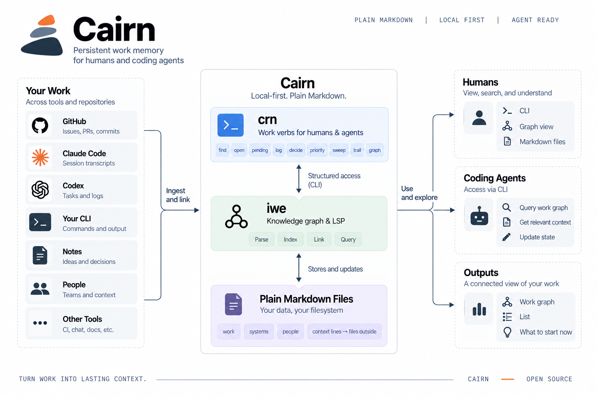
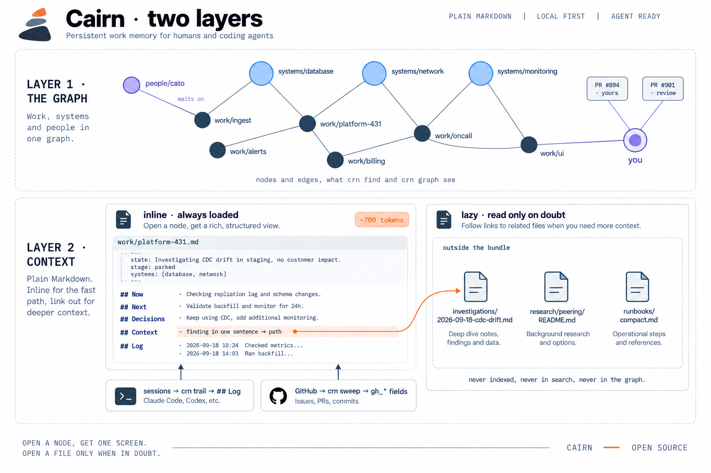

# Cairn

**Persistent work memory for humans and coding agents.** Cairn keeps the state of ongoing work in a
folder of plain Markdown: what is true, what comes next, what was decided, which systems are involved,
who it waits on. Deterministic tools keep it current. A person or an agent picks any piece of work up
again in one screen.

## Why

A coding-agent session ends and its context ends with it. The next session starts with the same
questions: which issue is this, what was decided, what was actually run, who is being waited on.
Answering them means re-reading long notes, re-fetching GitHub state and re-summarising, every time.

Cairn makes that a lookup. Each piece of work is one node with a one-sentence state and a resume point.
Each system is one card with how to reach it and what has gone wrong before. Sessions append to the
node's log by themselves; GitHub state is written once by a sweep. Opening a node costs about 700 tokens
and loads nothing else.

## How it works

<p align="center"></p>

Work arrives from GitHub, from agent transcripts and from the person doing it. Two tools keep it:
`crn`, the work verbs, and [`iwe`](https://github.com/iwe-org/iwe), the graph engine that indexes,
searches, validates and edits the Markdown. Humans read the result in an editor or in the local viewer;
agents read it through the same CLI, one node at a time. No database holds the truth, no model is
called, nothing leaves the machine.

<p align="center"></p>

**Layer one is the graph.** Work nodes, one per piece of work, linked to system nodes, one per thing
operated. People are small nodes for whoever work waits on. The user is a node as well, with review
requests, open pull requests and work that moved on GitHub hanging off it.

**Layer two is context**, in two forms. *Inline* context is the node body, always loaded with it:
state, Now, Next, Decisions, Log. *Lazy* context is one line in the body carrying a finding in one
sentence and the path of a file that lives outside the bundle, read only when something needs checking.
Investigations, research and runbooks stay where they are. Files outside the bundle are never indexed,
so nothing is loaded by accident.

## What it gives

- **Resume in one screen.** `crn open 431` returns state, resume point, next steps, decisions and the
  last sessions. No note re-reading, no re-fetching.
- **Nothing lost when a session dies.** A hook folds every session into the node's Log from the
  transcript: date, session id, call count, the commands that ran.
- **GitHub state written once.** The sweep refreshes `gh_*` fields, lists issues without a node, pull
  requests waiting for review and open pull requests, and proposes priorities from configured words.
- **Findings that stay findable.** A one-sentence Context line on the node is enough for search to hit
  it; the full file is one path away.
- **A picture at zero tokens.** The local viewer groups by repo, system, stage, priority or people,
  ranks what to start now with visible reasons, and copies the one `crn open` line for the agent.
- **Files you own.** Plain Markdown with YAML frontmatter, valid
  [Open Knowledge Format](https://github.com/GoogleCloudPlatform/knowledge-catalog/blob/main/okf/SPEC.md),
  readable and editable with any tool.

## One protocol

Everything is a CLI call. No MCP server, no tool schemas loaded per session, and every call lands in
the transcript where the trail can see it. The line the design rests on: anything that changes an
environment or code stays with the person or the agent under the person's permissions; anything
mechanical and read-only belongs in a tool. `crn` never comments on GitHub, never touches a cluster,
never writes outside the bundle.

| Verb | Does | Writes |
|---|---|---|
| `crn find <words>` | ranked search over titles, state lines and bodies | no |
| `crn open <node>` | one node with its links; a key, an issue number or a slug prefix | no |
| `crn pending` | work in progress, by priority then stage | no |
| `crn state` / `stage` / `priority` | set the one-line state, the stage, the priority level | the node |
| `crn log` / `decide` | append a dated line under Log or Decisions | the node |
| `crn sweep [--create]` | refresh GitHub fields, list what is new, rebuild the viewer | `gh_*`, `.cairn/` |
| `crn trail` | fold new transcripts into Log | Log only |
| `crn graph [--open]` | the local viewer; `--format json` or `gexf` for other tools | `.cairn/` only |
| `crn tidy` | the weekly weed-out report, read-only: oversized nodes, long Logs, dangling or placeholder Context lines, untriaged stubs, stage vs GitHub, quiet work, orphan systems; each finding says what to do | no |
| `crn validate` / `systems` / `init` / `doctor` | schema check; system counts; scaffold a bundle; check the wiring | no / no / a new bundle / no |

Two writers never touch the same field. A person owns `state`, `stage`, `Now`, `Next`, `Decisions`,
`Context` and `priority`. The producers own `gh_*` and `Log`. Schemas in `schemas/` are the contract and
`crn validate` enforces it.

## Quick start

```bash
# iwe: prebuilt binaries at https://github.com/iwe-org/iwe/releases (or brew install iwe-org/iwe/iwe)
git clone https://github.com/asitha-w/cairn && export PATH="$PWD/cairn/bin:$PATH"
export CAIRN_BUNDLE=$PWD/cairn/examples/bundle      # the example bundle: one org, five pieces of work
crn pending
crn find peering
crn open 431
crn graph --open
bash cairn/tests/selftest.sh                         # PASS/FAIL, no network
```

A bundle of your own: `crn init ~/my-graph` scaffolds it and prints the wiring steps, including the
Claude Code skill and the `/node` command. `crn doctor` reports what is still missing. `crn sweep
--create` seeds work nodes from open GitHub issues; system nodes are written by hand, one per thing
operated.

Step-by-step flow, the shape of a node and the code layout: [docs/how-it-works.md](docs/how-it-works.md).

## What Cairn is not

- Not a task tracker. GitHub (or whatever is in use) stays the system of record; a node points at it.
- Not agent memory in the chat sense. It holds work, systems and people, not conversation.
- Not a database. For multi-hop queries, build an index from `crn graph --format json` with an embedded
  graph database such as [LadybugDB](https://ladybugdb.com/) and discard it. The Markdown stays the truth.

## Status

v0.4. Two layers; the CLI with per-verb help and `--json`; `init`, `doctor`, `priority`, `tidy`, `graph` with the
viewer; three schemas; the example bundle; the Claude Code skill and command; the self-test. Not yet: a scheduled sweep, converters from other note formats.

MIT.

---

*Cairn is pronounced KAIRN. A cairn is the pile of stones on a hill path that marks the route when the fog comes in.*
