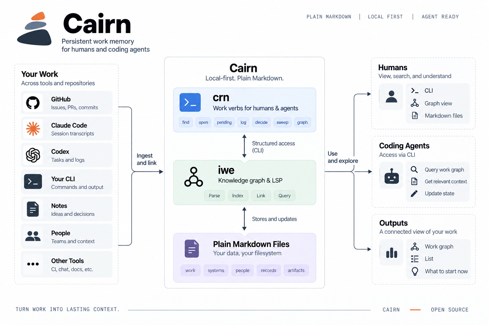

# Cairn

Cairn gives coding agents persistent memory of your work across sessions, repositories and tools.

It stores that memory as a local graph of plain Markdown, updated by deterministic tools and read by
both humans and agents. It exists because **a coding-agent session dies and the context dies with it**:
you kill a long Claude Code session, open a new one the next morning, and pay the onboarding tax
again: which issue was this, what did we decide, what did we actually run, who are we waiting on.

<p align="center"></p>

Cairn keeps the answer in a folder you own:

```
my-graph/
  cairn.toml                 who you are: GitHub org and user, where transcripts live
  work/platform-431.md       one piece of work: one-line state, Now, Next, Decisions, Context, Log
  systems/database.md        one thing you operate: how to reach it, where its config lives, gotchas, runbooks
  people/sam.md              someone work waits on
```

Two layers. Layer one is the graph: work nodes and system nodes, linked. Layer two is context, and it
hangs off a node in two forms: **inline** (the node body, always loaded with it) and **lazy** (one line
in the body, a finding in one sentence and the path of a file that lives outside the bundle, read only
when you or the agent are in doubt). Investigations, research write-ups, runbooks and plans stay where
they are; the node carries the sentence. Nothing is loaded by accident: iwe never indexes what is
outside the bundle, so the files never appear in search or in the graph.

Every file is an [Open Knowledge Format](https://github.com/GoogleCloudPlatform/knowledge-catalog/blob/main/okf/SPEC.md)
concept: YAML frontmatter plus markdown, linked with ordinary markdown links. Nothing is stored
anywhere else. No database is the truth, no model is called, nothing leaves the machine.

## A typical day, as a handshake

```
   you / Claude                                   crn (deterministic, no model)
   ────────────                                   ─────────────────────────────
   morning: "sweep"
        crn sweep                   ────────►     gh search ×3: issues assigned to you, PRs asking
                                                  your review, your PRs · match each issue to its
                                                  node by URL · write gh_state / gh_updated /
                                                  last_actor where they moved · propose a priority
                                                  from your word lists · save .cairn/sweep.json
                                    ◄────────     changed nodes · issues without a node · PR lists
        crn graph --open            ────────►     read every node · edges from frontmatter and
                                                  links · PRs from the last sweep · rank "what to
                                                  start now" by fixed rules · write one HTML file
                                    ◄────────     the picture, in your browser, zero tokens

   "let's work on peering"
        crn find peering            ────────►     iwe: BM25 over title and body + fuzzy on title
                                                  and key, fused · filter to work/system/person
                                    ◄────────     ranked nodes, one state line each
        crn open 431                ────────►     resolve 431 → work/devops-431 (key, issue number,
                                                  or slug prefix) · iwe retrieve · backlinks
                                    ◄────────     header · state · Now · Next · Decisions ·
                                                  Context · Log · linked from   (~700 tokens)
        gh issue view 431           ────────►     (GitHub, read-only: verify the dated claim)
        …work: kubectl, terraform, PRs…           never crn's business

   a milestone lands
        crn log 431 "NSGs applied"  ────────►     iwe update, expect exactly 1 node · append a
        crn decide / state / stage                dated line under Log (or Decisions) · set the
        crn priority 431 2                        field · stamp updated · schema-validated before
                                                  anything is written
                                    ◄────────     "work/devops-431: logged"

   you close the session            ────────►     hook: crn trail · scan new transcripts under your
                                                  prefix · a tool call names a node by key, slug or
                                                  issue ref → that node · one Log line per session
                                                  per node: date, id, call count, 3 command heads ·
                                                  never tool output or prompts · idempotent
```

Everything on the left needs judgment, and every change to an environment or to code happens there
under your permissions. Everything on the right is a script over your bundle: read-only toward GitHub,
writes only inside the bundle, guarded by the schemas, and the same result every time for the same
inputs. Longer version with the full flow: [docs/how-it-works.md](docs/how-it-works.md).

Once in a while: `crn sweep --create` to turn newly assigned issues into stub nodes, `crn pending` for the
plain list, `crn validate` after editing a node by hand, `crn doctor` when something feels off.

## The two halves

**`iwe` does the graph.** [IWE](https://github.com/iwe-org/iwe) (Rust, Apache 2.0) turns a markdown
folder into a queryable graph: full-text and fuzzy search, retrieval with linked context, schema
validation, and guarded atomic edits. Your editor gets an LSP for the same files. Cairn does not
reimplement any of that.

Three node types: **work** (a piece of work), **system** (a thing you operate) and **person** (someone
work waits on). Findings do not get nodes; they get one Context line on the node they belong to, and
`crn find` matches that line because it searches node bodies.

**`crn` does the work verbs.** A small Python package, standard library only (3.11+), that calls `iwe`
and adds what a work graph needs. `crn --help` lists the verbs, `crn <verb> --help` explains one, every
read verb takes `--json`:

| Verb | What it does | Writes |
|---|---|---|
| `crn find <words>` | ranked search over titles, state lines and bodies | no |
| `crn open <node>` | one node with its links; `<node>` is a key, a bare issue number or a slug prefix | no |
| `crn pending` | work whose stage is active, parked or blocked, newest first | no |
| `crn state <node> "…"` / `crn stage <node> <stage>` | set the one-line state / move between active, parked, blocked, done | the node |
| `crn priority [<node> [<n>]]` | print the bundle's priority legend, a node's level, or set it; levels and their names are yours, in `cairn.toml` | the node |
| `crn log <node> "…"` / `crn decide <node> "…"` | append a dated line under Log or Decisions | the node |
| `crn sweep [--create]` | refresh `gh_*` fields from GitHub; list assigned issues with no node, PRs requesting your review, and your open PRs; then regenerate the viewer | the node's `gh_*` fields, `.cairn/sweep.json`, `.cairn/graph.html` |
| `crn trail` | fold new Claude Code transcripts into Log, one line per session per node | Log only |
| `crn validate` | `iwe schema validate`; exit 1 on any violation | no |
| `crn systems` | system nodes with how many work nodes point at them | no |
| `crn graph [--open]` | a self-contained local viewer: group into sub-graphs by repo or system, colour by priority or stage, size by activity; click a node to focus on its neighbours and get a card whose "copy for Claude" button copies the one `crn open` line; a list mode and a "what to start now" mode rank work by transparent rules (review requests, priority, unblocked, GitHub moved after your update, untriaged, quiet) and show the reason per row; PRs from the last sweep appear as square nodes linked to the issues their titles name; you are a node too (ringed), with review requests, your PRs and work GitHub moved after your update hanging off it, so "group by people" shows what waits on whom and what waits on you; priority groups carry your legend's words; show has all/none; `--format json` or `gexf` for other tools | `.cairn/graph.*` only |
| `crn init <dir>` / `crn doctor` | scaffold a bundle and print the wiring steps / check python, iwe, gh, env, config, schemas, hook, skill | a new bundle / no |

Two writers never touch the same field. You (or your agent, on your say-so) own `state`, `stage`,
`Now`, `Next`, `Decisions`, `priority`. The producers own `gh_state`, `gh_updated`, `last_actor` and `Log`;
`crn sweep` may propose a `priority` from words you configure, marked `priority_by: sweep`, and never
overwrites one a human set. The
schemas in `schemas/` are the contract and `crn validate` enforces it.

## The shape of a work node

```markdown
---
type: work
title: Peer the dev database cluster to the ops network
state: "parked, waiting on Sam for the tier, the container CIDR and whether users are cluster-scoped"
stage: parked                      # active | parked | blocked | done
resource: https://github.com/acme/platform/issues/431
env: [dev, ops]
systems: [database, network]       # slugs of systems/*.md
people: [sam]                      # slugs of people/*.md
blocked_by: [work/platform-422]
gh_state: open                     # written by crn sweep
gh_updated: 2026-09-17T07:25:00Z   # written by crn sweep
last_actor: me                     # written by crn sweep
updated: 2026-09-18
---
# Peer the dev database cluster to the ops network

Systems: [Database cluster](../systems/database.md) · [Network](../systems/network.md) · waits on [Sam](../people/sam.md)

## Now
One dated paragraph: what is true. The resume point.
## Next
1. Numbered steps.
## Decisions
- 2026-09-17 one line per decision
## Context
- peering plan draft: subnets, NSGs and the order of operations → ../../files/platform-431/peering-plan-2026-09-16.md
## Log
- 2026-09-16 session 8ae135c0: 43 calls · `terraform plan` on the test project
```

The `state` line is what search shows and what you read first. Keep it to one sentence that would
let you decide whether to open the node. The links under the title are the graph edges; the
frontmatter lists are for filtering. Both name the same things.

## Using it with a coding agent

Everything is a CLI call, so no MCP server, no tool schemas loaded per session, and every call
lands in the transcript where `crn trail` can see it.

- `skills/cairn/SKILL.md` is a Claude Code skill: the five moves (find, open, work, record a milestone, sweep)
  and the rules (verify dated claims at the source, never bulk-read the bundle, writes only inside it).
- `commands/node.md` is a slash command that injects `crn open <node>` into the prompt before the
  model answers, so `/node 431` costs zero tool calls.

The rule the whole design rests on: **anything that changes an environment or code stays with the
agent under the user's permissions; anything mechanical and read-only belongs in a tool.** `crn`
never comments on GitHub, never touches a cluster, never writes outside the bundle.

## Layout

```
crn/cli.py       argparse front: one subcommand per verb, per-verb --help, --version
crn/bundle.py    find the bundle, read cairn.toml, the iwe wrapper, resolve a node from what you typed
crn/verbs.py     find, open, pending, systems, validate, state, stage, log, decide
crn/github.py    sweep: the only code that talks to GitHub (read-only, via your gh login) or a fixture
crn/trail.py     transcripts → Log
crn/setup.py     init and doctor
crn/graph.py     graph export: json, gexf, and the html viewer (crn/viewer.html, no dependencies)
bin/crn          two-line shim onto the package
schemas/         work, system, person (iwe document schemas)
examples/        the mock bundle, a GitHub fixture, a cairn.toml template
skills/, commands/   the Claude Code skill and the /node command
tests/selftest.sh    PASS/FAIL, no network
```

## Install and try

```bash
# iwe: prebuilt binaries at https://github.com/iwe-org/iwe/releases (or brew install iwe-org/iwe/iwe)
git clone https://github.com/asitha-w/cairn && export PATH="$PWD/cairn/bin:$PATH"
export CAIRN_BUNDLE=$PWD/cairn/examples/bundle      # the mock bundle: one org, five pieces of work
crn pending
crn find peering
crn open 431
crn sweep --fixture cairn/examples/github-fixture.json --create
bash cairn/tests/selftest.sh                         # PASS/FAIL, no network
```

Your own bundle: `crn init ~/my-graph` prints the four steps and the Claude Code wiring; `crn doctor`
tells you what is still missing. Then `crn sweep --create` seeds work nodes from your open GitHub
issues, and you write one system node per thing you operate.

## What Cairn is not

- Not a task tracker. GitHub (or whatever you use) stays the system of record; a node points at it.
- Not agent memory in the chat sense. It holds work, systems and people, not conversation.
- Not a database. `crn graph` gives you the picture from the files; for multi-hop queries build an index
  from `crn graph --format json` with an embedded graph database such as [LadybugDB](https://ladybugdb.com/)
  and throw it away when done. The markdown stays the truth.

## Status

v0.4: two layers (nodes, then inline or lazy context); the CLI as a package with per-verb help and
`--json`; `init`, `doctor`, `priority`, `graph` with a local viewer; the three schemas; the example
bundle; the skill and command; the self-test. Not yet: `crn tidy` (the periodic weed-out report),
`docker compose`, a scheduled sweep, converters from other note formats.

MIT.

---

*Cairn is pronounced KAIRN. A cairn is the pile of stones on a hill path that lets you pick the route up again when the fog comes in.*
