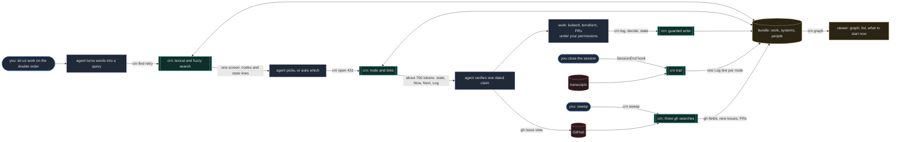

# How a session flows through Cairn

Everything that needs judgment stays with the person and the agent. Everything mechanical is a `crn` call:
deterministic, read-only toward GitHub, writing only inside your bundle, never calling a model. The
agent's context receives one screen per step instead of a folder of notes.



Legend: blue is you, purple is the agent (judgment, and the only thing that changes environments or
code), teal is `crn` (deterministic), amber is your bundle and the viewer built from it, red is
external sources read but never written.

What Cairn adds to the loop:

| Without Cairn | With Cairn |
|---|---|
| the agent greps notes, reads several files, guesses which thread you mean | one search call returns state lines; the agent picks or asks |
| resuming means re-reading a long note, often stale | one node, one screen, with what was actually run last time |
| what happened in a killed session is lost | the hook writes it into the node's Log from the transcript |
| GitHub state is re-fetched and re-summarised every time | the sweep writes `gh_*` fields once; nodes carry them |
| priorities live in someone's head | a field with your legend; the sweep proposes, you decide |
| the picture is in the agent's context, at token cost | `crn graph` renders it locally for free |

## A typical day, as a handshake

```
   you / Claude                                   crn (deterministic, no model)
   ────────────                                   ─────────────────────────────
   morning: "sweep"
        crn sweep                   ────────►     gh search ×3: issues assigned to you, PRs asking
                                                  your review, your PRs · match each issue to its
                                                  node by URL · write gh_state / gh_updated /
                                                  last_actor where they moved · propose a priority
                                                  from your word lists · save .cairn/sweep.json
                                    ◄────────     changed nodes · issues without a node · PR lists
        crn graph --open            ────────►     read every node · edges from frontmatter and
                                                  links · PRs from the last sweep · rank "what to
                                                  start now" by fixed rules · write one HTML file
                                    ◄────────     the picture, in your browser, zero tokens

   "let's work on the double order"
        crn find retry            ────────►     iwe: BM25 over title and body + fuzzy on title
                                                  and key, fused · filter to work/system/person
                                    ◄────────     ranked nodes, one state line each
        crn open 431                ────────►     resolve 431 → work/product-431 (key, issue number,
                                                  or slug prefix) · iwe retrieve · backlinks
                                    ◄────────     header · state · Now · Next · Decisions ·
                                                  Context · Log · linked from   (~700 tokens)
        gh issue view 431           ────────►     (GitHub, read-only: verify the dated claim)
        …work: kubectl, terraform, PRs…           never crn's business

   a milestone lands
        crn log 362 "pool 1 rolled"    ────────►     iwe update, expect exactly 1 node · append a
        crn decide / state / stage                dated line under Log (or Decisions) · set the
        crn priority 431 2                        field · stamp updated · schema-validated before
                                                  anything is written
                                    ◄────────     "work/platform-362: logged"

   you close the session            ────────►     hook: crn trail · scan new transcripts under your
                                                  prefix · a tool call names a node by key, slug or
                                                  issue ref → that node · one Log line per session
                                                  per node: date, id, call count, 3 command heads ·
                                                  never tool output or prompts · idempotent
```

Everything on the left needs judgment, and every change to an environment or to code happens there
under your permissions. Everything on the right is a script over your bundle: read-only toward GitHub,
writes only inside the bundle, guarded by the schemas, and the same result every time for the same inputs.

## What it looks like

```
$ crn pending
P2 active  work/compliance-377                2026-09-13  eleven of fourteen controls have dated evidence; waiting on Cato for the ac…
P2 blocked work/platform-408                  2026-09-14  change prepared and reviewed; blocked on Sindre approving a maintenance win…
   active  work/product-431                   2026-09-17  reproduced on staging with a throttled client; fix is the idempotency key i…
   active  work/platform-362                  2026-09-16  staging upgraded and soaked a week; prod waits for the edge allowlist chang…
   parked  work/product-419                   2026-09-15  prototype deployed to the lab and demoed; parked until Ingrid picks a meter…

$ crn find retry
work    work/product-431                   order-api creates a second order on a client retry
        active · reproduced on staging with a throttled client; fix is the idempotency key in PR #440, wai…
system  systems/order-api                  order-api
work    work/platform-408                  Rotate the VPN certificate authority and close the legacy S…
        blocked · change prepared and reviewed; blocked on Sindre approving a maintenance window, and on th…

$ crn open 431
work/product-431 · active · updated 2026-09-17 · gh open 2026-09-18 last cato
state: reproduced on staging with a throttled client; fix is the idempotency key in PR #440, waiting on Cato's review
env staging, prod · systems order-api, ci · people cato

… the node's Now, Next, Decisions, Context, Log …

$ crn log 362 "prod pool 1 rolled, runners back"
work/platform-362: logged
$ crn sweep
sweep: 6 items · 1 node(s) updated · 1 without a node
  updated work/product-431: gh_state=open gh_updated=2026-09-18
  new     vanaheim/compliance#512 Add the new payments vendor to the supplier register before the audit
review requested from you (1):
  vanaheim/platform#455 Bump the ingress chart for the next Kubernetes minor (#362) · 2026-09-19
your open PRs (1):
  vanaheim/product#440 fix(order-api): idempotency key on submit (#431) · 2026-09-17

$ crn tidy
tidy 2026-09-20: 0 finding(s) over 6 work · 7 systems · 3 people · nothing to weed
```

## The shape of a work node

```markdown
---
type: work
title: order-api creates a second order on a client retry
state: "reproduced on staging with a throttled client; fix is the idempotency key in PR #440, waiting on Cato's review"
stage: active                      # active | parked | blocked | done
resource: https://github.com/vanaheim/product/issues/431
env: [staging, prod]
systems: [order-api, ci]           # slugs of systems/*.md
people: [cato]                     # slugs of people/*.md
blocked_by: []
gh_state: open                     # written by crn sweep
gh_updated: 2026-09-18T07:25:00Z   # written by crn sweep
last_actor: cato                   # written by crn sweep
updated: 2026-09-17
---
# order-api creates a second order on a client retry

[order-api](../systems/order-api.md) · [ci](../systems/ci.md) · reviewer [Cato](../people/cato.md)

## Now

2026-09-17. Two customers reported double orders after a slow checkout. Reproduced on staging by throttling the client to 3G: the retry lands after the first request has committed. PR #440 adds an idempotency key on submit and a 24-hour dedupe table. Cato has the review.

## Next

1. Address Cato's review, merge, let CI take it to staging.
2. Replay the two customer cases against staging before the prod deploy.
3. Prod deploy through the release environment; watch the duplicate-order metric for a day.

## Decisions

- 2026-09-17 dedupe on an idempotency key, not on payload hash: two identical orders in a row are legal

## Context

- reproduction log: the throttled-client steps, the two requests and the timestamps → ../../files/product-431/repro-2026-09-17.md

## Log

- 2026-09-16 session 8ae135c0: 43 calls · `kubectl -n orders logs` · `make test`
- 2026-09-17 session e1d9e214: 19 calls · `gh pr create` · `curl` against staging
```

The `state` line is what search shows and what you read first: one sentence that lets you decide
whether to open the node. A finding that stays true after the work is done goes on the system node as a
Gotcha; one whose depth is in a file becomes a Context line. Files live outside the bundle, so `iwe`
never indexes them and they never appear in search or in the graph.

## Code layout

```
crn/cli.py       argparse front: one subcommand per verb
crn/bundle.py    find the bundle, read cairn.toml, the iwe wrapper, resolve a node from what you typed
crn/verbs.py     find, open, pending, systems, validate, state, stage, log, decide
crn/github.py    sweep: the only code that talks to GitHub (read-only, via your gh login) or a fixture
crn/trail.py     transcripts → Log
crn/setup.py     init and doctor
crn/graph.py     graph export: json, gexf, and the html viewer (crn/viewer.html)
schemas/         work, system, person (iwe document schemas)
examples/        the mock bundle, its lazy files, a GitHub fixture, a cairn.toml template
skills/, commands/   the Claude Code skill and the /node command
tests/selftest.sh    PASS/FAIL, no network
```
