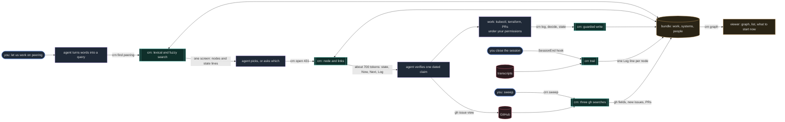

# How a session flows through Cairn

Everything that needs judgment stays with you and your agent. Everything mechanical is a `crn` call:
deterministic, read-only toward GitHub, writing only inside your bundle, never calling a model. The
agent's context receives one screen per step instead of a folder of notes.



Legend: blue is you, purple is the agent (judgment, and the only thing that changes environments or
code), teal is `crn` (deterministic), amber is your bundle and the viewer built from it, red is
external sources read but never written.

What Cairn adds to the loop:

| Without Cairn | With Cairn |
|---|---|
| the agent greps notes, reads several files, guesses which thread you mean | one search call returns state lines; the agent picks or asks |
| resuming means re-reading a long note, often stale | one node, one screen, with what was actually run last time |
| what happened in a killed session is lost | the hook writes it into the node's Log from the transcript |
| GitHub state is re-fetched and re-summarised every time | the sweep writes `gh_*` fields once; nodes carry them |
| priorities live in someone's head | a field with your legend; the sweep proposes, you decide |
| the picture is in the agent's context, at token cost | `crn graph` renders it locally for free |

## What it looks like

```
$ crn pending
parked  work/platform-431   2026-09-18  parked, waiting on Sam for the tier, the container CIDR and whether users are cl
active  work/platform-362   2026-09-17  decision taken: renew one year; figures reconciled; purchase is user-run before
active  work/platform-419   2026-09-17  deletes done (5.6B documents); compact per node and the tier downsize remain
blocked work/manifests-894  2026-09-07  two PRs open, changes requested on the manifests one; waiting on my rebase

$ crn find peering
system  systems/network      Network
work    work/platform-431    Peer the dev database cluster to the ops network
        parked · parked, waiting on Sam for the tier, the container CIDR …

$ crn open 431
work/platform-431 · parked · updated 2026-09-18 · gh open 2026-09-18 last sam
state: parked, waiting on Sam for the tier, the container CIDR and whether users are cluster-scoped
env dev, ops · systems database, network · people sam · blocked_by work/platform-422
… the node's Now, Next, Decisions, Artifacts, Log …
linked from (2): work/platform-422 · systems/network

$ crn log 419 "compact pass A done on node 1"
$ crn sweep
sweep: 5 items · 1 node(s) updated · 1 without a node
  updated work/platform-431: gh_state=open gh_updated=2026-09-18
  new     acme/platform#512 Alert on backup freshness for the object store
```
